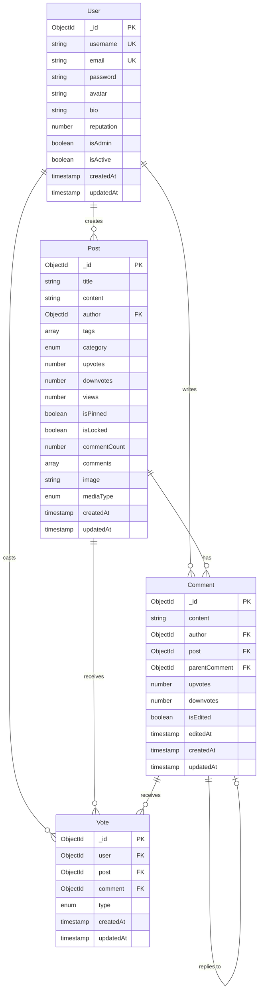
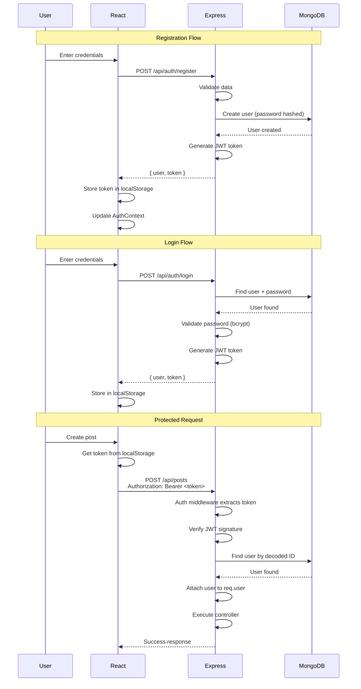
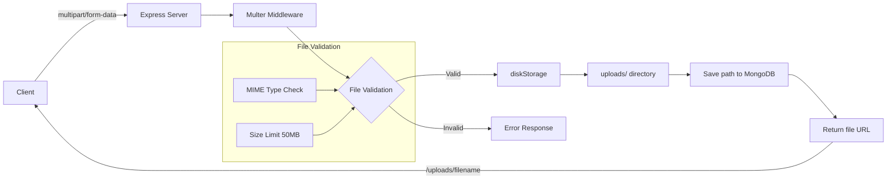
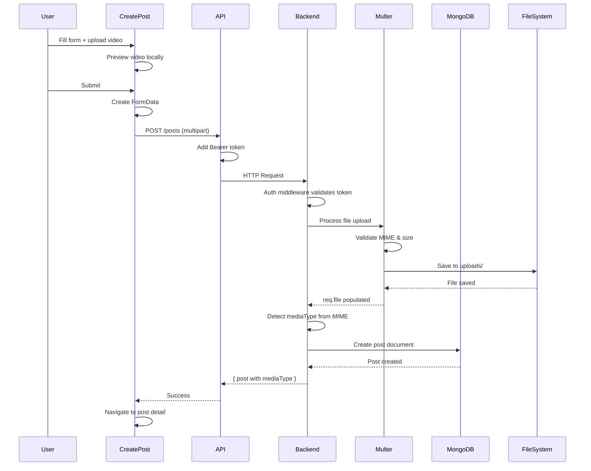
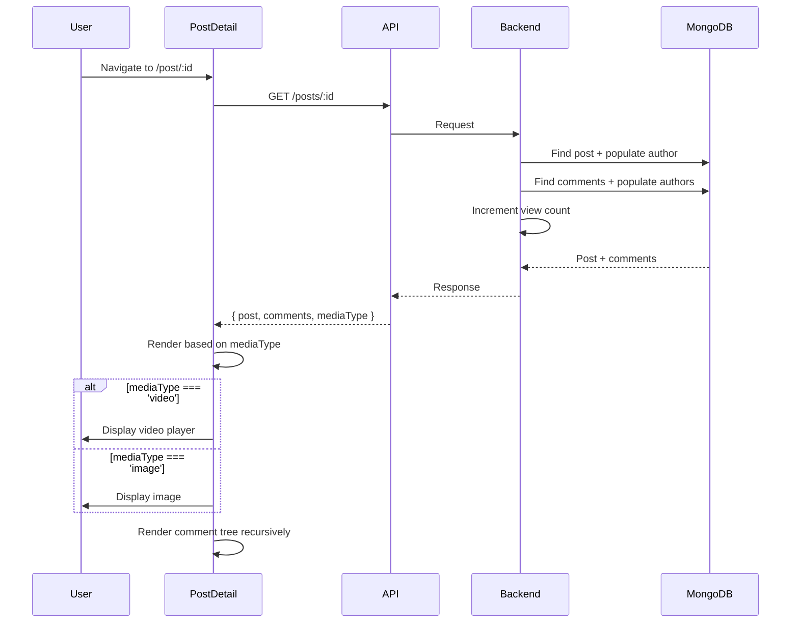
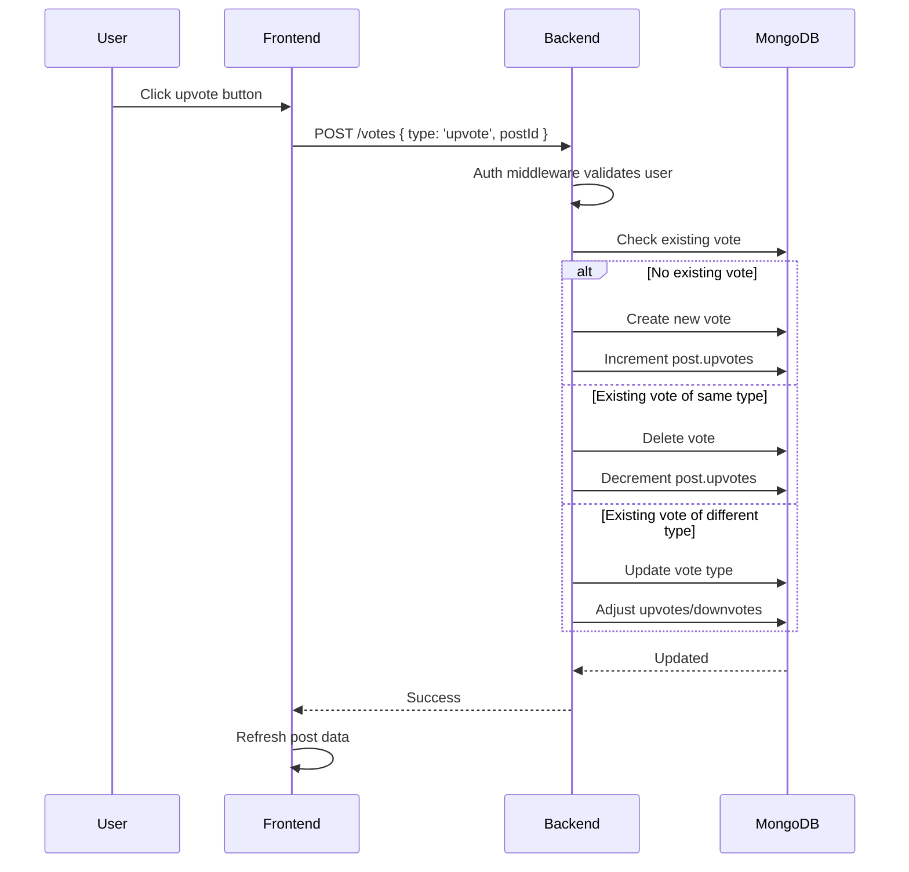

# BK-Forum - Comprehensive System Architecture Report

## Executive Summary

BK-Forum is a full-stack web forum application built with a modern MERN stack (MongoDB, Express.js, React, Node.js). The system supports user authentication, post creation with media (images/videos), commenting with nested replies, voting system, and user profiles. This document provides a complete analysis of the system architecture from frontend to backend and database interactions.

---

## Technology Stack

### Backend
- **Runtime**: Node.js
- **Framework**: Express.js 4.x
- **Database**: MongoDB with Mongoose ODM 7.x
- **Authentication**: JWT (JSON Web Tokens) via jsonwebtoken
- **Security**: 
  - Helmet (security headers)
  - CORS (cross-origin resource sharing)
  - express-rate-limit (rate limiting)
  - bcryptjs (password hashing)
- **File Upload**: Multer 2.x
- **Development**: Nodemon

### Frontend
- **Framework**: React 18.x
- **Build Tool**: Vite 4.x
- **Routing**: React Router DOM 6.x
- **HTTP Client**: Axios 1.x
- **State Management**: 
  - React Context API (AuthContext)
  - React Hook Form (form handling)
- **UI Libraries**: 
  - Lucide React (icons)
  - React Hot Toast (notifications)
  - Tailwind CSS (styling)

### Infrastructure
- **Containerization**: Docker support via docker-compose.yml
- **File Storage**: Local filesystem (`uploads/` directory)
- **Environment**: dotenv for configuration

---

## System Architecture

```mermaid
graph TB
    subgraph "Client Layer"
        Browser[Web Browser]
        React[React App<br/>Vite Dev Server<br/>Port 5173]
    end
    
    subgraph "Application Layer"
        Express[Express Server<br/>Port 3000]
        
        subgraph "Middleware"
            Helmet[Helmet<br/>Security]
            RateLimit[Rate Limiter]
            CORS[CORS Handler]
            Auth[JWT Auth<br/>Middleware]
            Upload[Multer<br/>File Upload]
        end
        
        subgraph "Routes"
            AuthRoutes[/api/auth]
            UserRoutes[/api/users]
            PostRoutes[/api/posts]
            CommentRoutes[/api/comments]
            VoteRoutes[/api/votes]
        end
        
        subgraph "Controllers"
            AuthCtrl[authController]
            UserCtrl[userController]
            PostCtrl[postController]
            CommentCtrl[commentController]
            VoteCtrl[voteController]
        end
    end
    
    subgraph "Data Layer"
        MongoDB[(MongoDB Database)]
        FileSystem[File System<br/>uploads/]
        
        subgraph "Collections"
            Users[users]
            Posts[posts]
            Comments[comments]
            Votes[votes]
        end
    end
    
    Browser --> React
    React -->|HTTP/HTTPS| Express
    Express --> Helmet
    Helmet --> RateLimit
    RateLimit --> CORS
    CORS --> Routes
    Routes -.->|Protected| Auth
    Routes -.->|File Upload| Upload
    Routes --> Controllers
    Controllers --> MongoDB
    Controllers --> FileSystem
    MongoDB --> Users
    MongoDB --> Posts
    MongoDB --> Comments
    MongoDB --> Votes
```

---

## Database Schema & Relationships

### Entity Relationship Diagram



### Collection Details

#### **Users Collection**
- **Purpose**: Store user account information
- **Indexes**: 
  - Unique on `username`
  - Unique on `email`
- **Special Features**:
  - Password hashing via bcrypt (pre-save hook)
  - Password validation method `matchPassword()`
  - Virtual field `posts` (reverse population)

#### **Posts Collection**
- **Purpose**: Store forum posts with optional media
- **Indexes**:
  - Text index on `title`, `content`, `tags` (for search)
  - Sort indexes on `createdAt`, `upvotes`, `views`
- **Categories**: `general`, `academic`, `technology`, `sports`, `entertainment`, `other`
- **Media Support**: 
  - `image` field stores file path (`/uploads/filename`)
  - `mediaType` field: `'image'`, `'video'`, or `null`

#### **Comments Collection**
- **Purpose**: Store nested comments/replies
- **Indexes**:
  - Compound index on `post` + `createdAt`
  - Index on `parentComment`
- **Special Features**:
  - Virtual field `replies` (reverse population)
  - Self-referential for nested replies via `parentComment`

#### **Votes Collection**
- **Purpose**: Track upvotes/downvotes on posts and comments
- **Indexes**:
  - Unique compound on `user` + `post` (sparse)
  - Unique compound on `user` + `comment` (sparse)
- **Constraints**:
  - User can only vote once per post/comment
  - Must be associated with either post OR comment, not both (pre-save validation)
  - Vote type: `'upvote'` or `'downvote'`

---

## API Endpoints Reference

### Authentication (`/api/auth`)

| Method | Endpoint | Auth | Description |
|--------|----------|------|-------------|
| POST | `/register` | ❌ | Register new user account |
| POST | `/login` | ❌ | Login and receive JWT token |
| GET | `/me` | ✅ | Get current authenticated user |

**Request/Response Examples:**

```javascript
// POST /api/auth/register
Request: { username, email, password }
Response: { _id, username, email, token }

// POST /api/auth/login
Request: { email, password }
Response: { _id, username, email, token }

// GET /api/auth/me
Headers: { Authorization: "Bearer <token>" }
Response: { _id, username, email, avatar, bio, reputation, ... }
```

### Posts (`/api/posts`)

| Method | Endpoint | Auth | Description |
|--------|----------|------|-------------|
| GET | `/` | ❌ | Get all posts (paginated, filtered, sorted) |
| GET | `/:id` | ❌ | Get single post with details |
| POST | `/` | ✅ | Create new post (multipart/form-data) |
| PUT | `/:id` | ✅ | Update post (author only) |
| DELETE | `/:id` | ✅ | Delete post (author/admin only) |

**Query Parameters** (GET `/`):
- `page`: Page number (default: 1)
- `limit`: Items per page (default: 10)
- `category`: Filter by category
- `search`: Full-text search
- `sort`: `newest`, `oldest`, `popular`, `most_viewed`

**Create Post Request:**
```javascript
// POST /api/posts
Content-Type: multipart/form-data
Headers: { Authorization: "Bearer <token>" }
Body: {
  title: string,
  content: string,
  category: enum,
  image: File (optional),
  mediaType: 'image' | 'video' (optional)
}
```

### Comments (`/api/comments`)

| Method | Endpoint | Auth | Description |
|--------|----------|------|-------------|
| GET | `/post/:postId` | ❌ | Get all comments for a post |
| POST | `/` | ✅ | Create new comment |
| PUT | `/:id` | ✅ | Update comment (author only) |
| DELETE | `/:id` | ✅ | Delete comment (author only) |

**Create Comment Request:**
```javascript
// POST /api/comments
Request: { content, postId, parentComment? }
```

### Votes (`/api/votes`)

| Method | Endpoint | Auth | Description |
|--------|----------|------|-------------|
| POST | `/` | ✅ | Cast a vote (upvote/downvote) |
| PUT | `/:id` | ✅ | Update existing vote |
| DELETE | `/:id` | ✅ | Remove vote |

**Create Vote Request:**
```javascript
// POST /api/votes
Request: { 
  type: 'upvote' | 'downvote',
  postId?: ObjectId,
  comment?: ObjectId
}
```

### Users (`/api/users`)

| Method | Endpoint | Auth | Description |
|--------|----------|------|-------------|
| GET | `/:id` | ❌ | Get user profile |
| PUT | `/:id` | ✅ | Update user profile (self only) |

---

## Authentication & Authorization Flow

### JWT Authentication Architecture



### Authorization Middleware (`middlewares/auth.js`)

**Flow:**
1. Extract token from `Authorization: Bearer <token>` header
2. Verify JWT signature using `JWT_SECRET`
3. Decode token to get user ID
4. Query database to validate user exists
5. Attach user object to `req.user`
6. Call `next()` to proceed to route handler

**Error Cases:**
- No token provided → 401 Unauthorized
- Invalid/expired token → 401 Unauthorized
- User not found → 401 Unauthorized

---

## File Upload System

### Architecture



### Multer Configuration (`middlewares/upload.js`)

**Accepted File Types:**
- **Images**: `image/jpeg`, `image/png`, `image/jpg`, `image/gif`
- **Videos**: `video/mp4`, `video/quicktime` (MOV), `video/webm`

**Storage Settings:**
- **Destination**: `uploads/` directory (local filesystem)
- **Filename Pattern**: `{fieldname}_{timestamp}{extension}`
  - Example: `image_1702734521234.jpg`
- **Size Limit**: 50 MB maximum
- **Field Name**: `image` (used for both images and videos)

**Media Type Detection:**
- Controller automatically detects media type from MIME type
- Stores in `mediaType` field: `'image'` or `'video'`

**Static Serving:**
- Files served via `/uploads` route
- Frontend accesses: `http://localhost:3000/uploads/filename`

---

## Frontend Architecture

### Component Hierarchy

```
App.jsx (Root)
├── AuthProvider (Context)
├── Router
│   ├── Header
│   └── Routes
│       ├── Home
│       │   └── PostCard (multiple)
│       ├── PostDetail
│       │   ├── Video/Image Player
│       │   └── CommentTree
│       │       └── CommentTree (recursive)
│       ├── CreatePost
│       ├── Login
│       ├── Register
│       └── Profile
```

### State Management

#### **AuthContext** (`store/authContext.jsx`)

**Purpose**: Global authentication state

**State:**
```javascript
{
  user: { _id, username, email } | null,
  token: string | null,
  isAuthenticated: boolean,
  loading: boolean
}
```

**Actions:**
- `login(authData)`: Store user and token in localStorage and state
- `logout()`: Clear localStorage and state

**Persistence**: 
- Stores token and user in `localStorage`
- Rehydrates state on app load

#### **API Client** (`api/api.js`)

**Axios Instance Configuration:**
- Base URL: `VITE_API_URL` or `http://localhost:3000/api`
- Request Interceptor: Automatically adds JWT token to headers
- Response Interceptor: Handles 401 errors, redirects to login

```javascript
// Request flow
api.get('/posts') 
  → Interceptor adds: { Authorization: "Bearer <token>" }
  → Server receives authenticated request
```

### Routing Configuration

| Path | Component | Purpose |
|------|-----------|---------|
| `/` | Home | Post feed with filters/search |
| `/login` | Login | User login form |
| `/register` | Register | User registration form |
| `/post/:id` | PostDetail | Single post view with comments |
| `/create-post` | CreatePost | New post creation form |
| `/profile/:id` | Profile | User profile page |

---

## Data Flow Patterns

### Creating a Post with Media



### Viewing a Post with Comments



### Vote System Flow



---

## Security Measures

### Backend Security

1. **Helmet**: Security headers (XSS protection, content type sniffing prevention, etc.)
2. **CORS**: Controlled cross-origin access (origin whitelist)
3. **Rate Limiting**: 1000 requests per 15 minutes
4. **Password Hashing**: bcrypt with salt rounds
5. **JWT Expiration**: Token expires after configured time
6. **Input Validation**: Mongoose schema validation + express-validator
7. **File Upload Security**:
   - MIME type whitelist
   - File size limits
   - Sanitized filenames

### Frontend Security

1. **Token Storage**: localStorage (consider httpOnly cookies for production)
2. **Automatic Logout**: 401 responses clear auth state
3. **Protected Routes**: Auth context checks before rendering
4. **XSS Prevention**: React auto-escapes output
5. **CSRF**: Not implemented (consider for production)

---

## Request-Response Lifecycle

### Example: Authenticated Post Creation

```
1. CLIENT SIDE
   ├─ User fills CreatePost form
   ├─ User uploads video file
   ├─ User clicks "Post" button
   ├─ CreatePost component:
   │  ├─ Creates FormData object
   │  ├─ Appends fields: title, content, category, image, mediaType
   │  └─ Calls api.post('/posts', formData)
   │
   └─ Axios interceptor adds Authorization header

2. NETWORK
   └─ HTTP POST http://localhost:3000/api/posts
      Headers:
        Content-Type: multipart/form-data
        Authorization: Bearer eyJhbGc...
      Body: (FormData with file)

3. BACKEND - EXPRESS MIDDLEWARE CHAIN
   ├─ Helmet → Security headers added
   ├─ Rate Limiter → Check request count
   ├─ CORS → Validate origin
   ├─ Body Parser → Parse JSON (skipped for multipart)
   ├─ Router → Match /api/posts POST
   ├─ Auth Middleware:
   │  ├─ Extract token
   │  ├─ Verify JWT
   │  ├─ Query User from MongoDB
   │  └─ Attach user to req.user
   ├─ Multer Middleware:
   │  ├─ Parse multipart/form-data
   │  ├─ Validate file type & size
   │  ├─ Generate filename
   │  ├─ Save to uploads/ directory
   │  └─ Attach file info to req.file
   └─ Controller (createPost):
      ├─ Extract body fields
      ├─ Detect mediaType from MIME
      ├─ Create Post document in MongoDB
      ├─ Populate author field
      └─ Return response

4. DATABASE - MONGODB
   ├─ Insert document into posts collection
   ├─ Auto-generate _id (ObjectId)
   ├─ Set timestamps (createdAt, updatedAt)
   ├─ Run validations
   └─ Return created document

5. BACKEND RESPONSE
   └─ HTTP 201 Created
      Body: {
        _id, title, content, category,
        author: { _id, username, avatar },
        image: "/uploads/image_1702734521234.mp4",
        mediaType: "video",
        upvotes: 0, views: 0, commentCount: 0,
        createdAt, updatedAt
      }

6. CLIENT SIDE
   ├─ Axios receives response
   ├─ CreatePost component:
   │  ├─ Shows success toast
   │  └─ Navigates to /post/:id
   └─ PostDetail loads and displays video
```

---

## Performance Optimizations

### Database
- **Indexes**: Text search, sort fields, foreign keys
- **Sparse Indexes**: Unique constraints on optional fields
- **Pagination**: Limit query results (default 10 per page)
- **Selective Population**: Only populate required fields

### Backend
- **Static File Serving**: Express.static for uploads
- **Rate Limiting**: Prevent API abuse
- **Efficient Queries**: Projection to limit returned fields

### Frontend
- **Code Splitting**: Vite automatic chunking
- **Lazy Loading**: React Router lazy loading (not implemented)
- **Optimistic Updates**: Could be added for votes
- **Media Optimization**: `preload="metadata"` for videos

---

## Environment Configuration

### Backend (`.env`)
```
MONGODB_URI=mongodb://localhost:27017/bkforum
JWT_SECRET=<secret_key>
JWT_EXPIRE=30d
PORT=3000
CORS_ORIGIN=http://localhost:5173
```

### Frontend (`.env`)
```
VITE_API_URL=http://localhost:3000/api
```

---

## Deployment Architecture

### Development
```
Frontend (Vite) :5173 ←→ Backend (Express) :3000 ←→ MongoDB :27017
```

### Production (Suggested)
```
User → Nginx (Reverse Proxy)
       ├→ Static Files (React build)
       └→ API (Express) → MongoDB Atlas
                        → Cloud Storage (S3/GCS) for media
```

---

## Future Enhancements

### Recommended Improvements

1. **Media Storage**: 
   - Move to cloud storage (AWS S3, Google Cloud Storage)
   - Add video transcoding for web optimization
   - Generate thumbnails for videos

2. **Real-time Features**:
   - WebSocket integration (Socket.io)
   - Live notifications
   - Real-time comment updates

3. **Search**:
   - Elasticsearch integration
   - Advanced filtering
   - Faceted search

4. **Caching**:
   - Redis for session storage
   - Cache popular posts
   - Rate limiting with Redis

5. **Testing**:
   - Unit tests (Jest)
   - Integration tests (Supertest)
   - Frontend tests (React Testing Library)

6. **Security**:
   - httpOnly cookies for tokens
   - CSRF protection
   - Content Security Policy
   - Input sanitization

7. **Features**:
   - User roles and permissions
   - Post bookmarks/favorites
   - Email notifications
   - Rich text editor
   - Markdown support
   - Image/video compression

---

## Conclusion

BK-Forum is a well-architected forum application with clean separation of concerns, RESTful API design, and modern frontend practices. The system successfully implements core forum features including authentication, posts with media support, nested commenting, and voting. The architecture is scalable and maintainable, with clear patterns for extension and enhancement.

**Key Strengths:**
- Clean MVC architecture on backend
- Proper authentication/authorization
- Flexible media upload system
- Responsive React frontend
- Good database schema design

**Areas for Production Readiness:**
- Cloud media storage
- Comprehensive testing
- Enhanced security measures
- Performance monitoring
- Error logging and analytics
